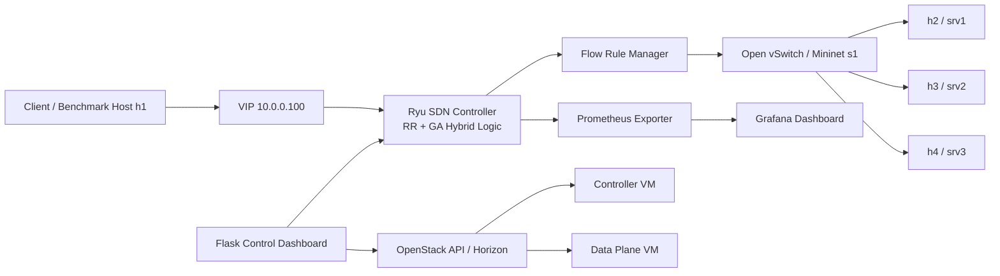

# SDN Hybrid Load Balancer with OpenStack, Ryu, Mininet, Prometheus, and Grafana

This repository is a **completed project package** for the research topic:

**An SDN-Based Adaptive Cloud Network Management Framework with Resource Optimization, Security Enforcement, and ML-Driven Intelligence: Hybrid Load Balancing Algorithm for SDN-Based Cloud Resource Allocation**

It combines:
- **OpenStack** for the experiment infrastructure (Controller VM + Data Plane VM).
- **Ryu SDN controller** for programmable flow control.
- **Mininet + OVS** for the emulated SDN data plane.
- **Hybrid RR + GA algorithm** for fast routing and long-term optimization.
- **Flask control dashboard** for operator actions.
- **Prometheus + Grafana** for monitoring dashboards.
- **PyCharm + Git workflow** for development and VM deployment.

## What is included
- `vm-a1-controller/` – Ryu controller, hybrid algorithm, REST API.
- `vm-a2-dataplane/` – Mininet topology and benchmark tools.
- `dashboard/` – web dashboard for controller actions and optional OpenStack actions.
- `monitoring/` – controller Prometheus exporter, Prometheus config, Grafana dashboard JSON.
- `infra/openstack/` – OpenStack helper code and lab provisioning script.
- `scripts/` – VM bootstrap and launcher scripts.
- `docs/` – Horizon deployment, PyCharm/Git workflow, testing, security notes.
- `tests/` – smoke tests for the hybrid algorithm and exporter helpers.

## Architecture


## Main project features
- **Real-time load balancing** using Round Robin or Smooth Weighted Round Robin.
- **GA-based weight optimization** using CPU, memory, bandwidth, connections, and SLA latency penalties.
- **Session stickiness** for existing flows.
- **Overload protection** for new flows.
- **REST API** to inspect status and trigger recomputation.
- **OpenStack-ready deployment** with Horizon and SDK workflow.
- **Monitoring dashboards** for controller and backend visibility.

## Important fix applied to the supplied code
The original bundle normalized connection pressure using the **current maximum observed connections**, which could mark a backend as overloaded after only one flow and break session stickiness. This package fixes that by using a per-backend **`max_connections` capacity** and by keeping existing flows sticky while overload gating applies only to **new** flows.

## Fastest demo path
1. Read `docs/OPENSTACK_HORIZON_DEPLOYMENT.md` and launch two Ubuntu VMs in OpenStack.
2. Clone this repo on both VMs, or clone from the provided `.bundle` file.
3. On the controller VM:
   ```bash
   bash scripts/bootstrap_controller_vm.sh
   cd vm-a1-controller
   ./run_controller.sh
   ```
4. On the data plane VM:
   ```bash
   bash scripts/bootstrap_dataplane_vm.sh
   cd vm-a2-dataplane
   CTRL_IP=<controller_private_ip> ./run_mininet.sh
   ```
5. In the Mininet CLI:
   ```bash
   h1 curl http://10.0.0.100:8000
   h1 python3 tools/http_benchmark.py --url http://10.0.0.100:8000 --concurrency 50 --duration 20 --sla-ms 200
   ```
6. Optional control dashboard on the controller VM:
   ```bash
   python3 -m venv .venv-dashboard
   source .venv-dashboard/bin/activate
   pip install -r dashboard/requirements-dashboard.txt
   LB_CONTROLLER_URL=http://127.0.0.1:8080 python3 -m dashboard.app
   ```
   Open `http://<controller-vm>:5555`.

## PyCharm and Git workflow
Follow `docs/PYCHARM_GIT_VM_WORKFLOW.md`.

If you want to clone directly on a VM **without first pushing to GitHub**, use the generated Git bundle:
```bash
git clone sdn_hybrid_openstack_project.bundle sdn-hybrid-openstack-project
```

## Controller API
- `GET /lb/status`
- `POST /lb/recompute`
- `POST /lb/health/<backend_name>` with JSON body `{"healthy": true|false}`

See `docs/API_REFERENCE.md`.

## Monitoring stack
- Exporter: `monitoring/controller_exporter.py`
- Prometheus example config: `monitoring/prometheus.yml`
- Grafana dashboard JSON: `monitoring/grafana/dashboards/sdn_hybrid_lb_dashboard.json`

## Evaluation checklist
- Throughput: `tools/http_benchmark.py`
- Latency: p50 and p95 from HTTP benchmark
- SLA compliance: benchmark output percentage under threshold
- Load distribution: dashboard / status API / exporter metrics
- Fault tolerance: toggle backend health via dashboard or REST API

## Test locally
```bash
python3 -m pytest
```
